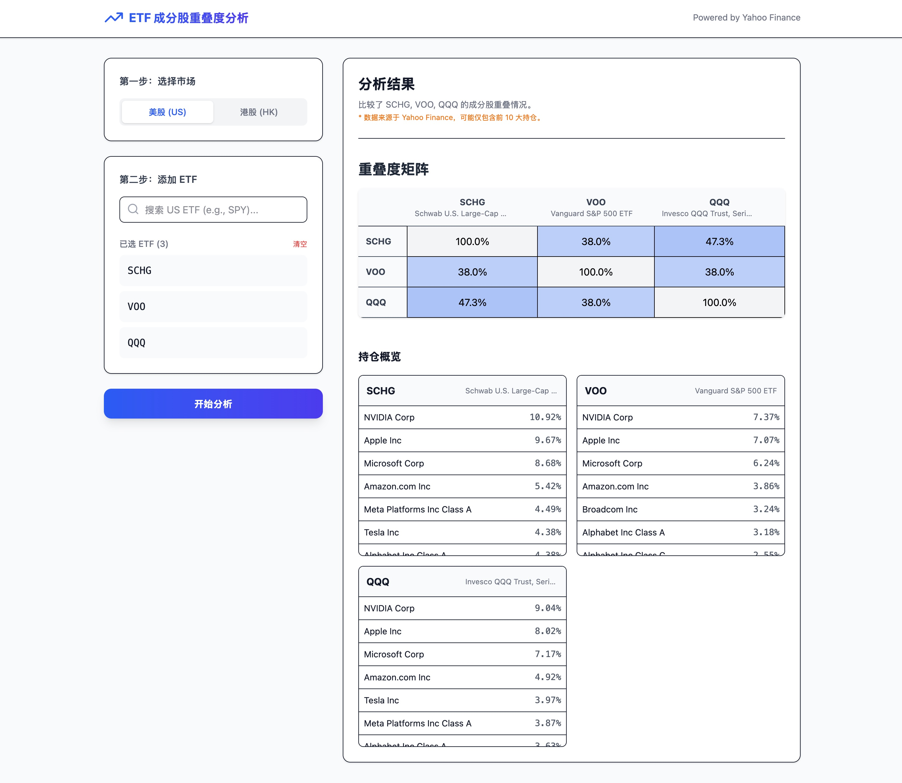

# ETF Overlap Calculator

[https://etf.domc.me/](https://etf.domc.me/)

这是一个用于分析和计算不同 ETF（交易所交易基金）之间持仓重叠度的工具。帮助投资者了解不同 ETF 组合的真实分散程度，避免因持仓重复而导致的风险集中。

## 主要功能

### 1. ETF 搜索

- 支持通过代码（Symbol）或名称搜索全球市场的 ETF。
- 基于 Yahoo Finance 数据源，覆盖广泛。

### 2. 持仓分析

- 自动获取选中 ETF 的前十大持仓股（Top Holdings）。
- 显示每个持仓股的名称、代码及权重占比。

### 3. 重叠度计算 (Overlap Analysis)

- **重叠权重计算**：计算两个 ETF 之间在相同持仓上的权重重叠总和。
  - 例如：如果 ETF A 持有 5% 的 NVDA，ETF B 持有 3% 的 NVDA，则这部分的重叠为 3%。
- **重叠矩阵**：通过矩阵视图直观展示多个 ETF 两两之间的重叠程度。

### 4. 详细对比

- 点击重叠矩阵中的单元格，可以查看具体的共同持仓明细。
- 列出共同持有的股票及其在各自 ETF 中的具体权重。

## 技术栈

- **前端**: React, TypeScript, Tailwind CSS
- **构建工具**: Vite
- **后端/API**: Node.js, Express (适配 Vercel Serverless Functions)
- **数据源**: Yahoo Finance API (yahoo-finance2)
